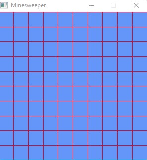
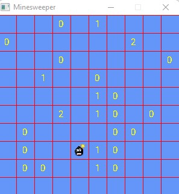

# Game Minesweeper 

## Idea

The objective is to find mines that are randomly hidden by
the computer in the boxes of the table.

If the chosen square contains a mine, the game is lost.

If the chosen box does not contain a mine then a number will appear
indicating the number of mines that are in the 8 squares that touch
directly to the selected box.




## Subject

```
This involves playing a mine-sweeper game. The
type declarations and the requested subroutines must be written
in C/C++ language.

Principle of the game:

The objective is to find mines that are randomly hidden by
the computer in the boxes of the table.

If the chosen square contains a mine, the game is lost.

If the chosen box does not contain a mine then a number will appear
indicating the number of mines that are in the 8 squares that touch
directly to the selected box.

For example if the number discovered is a 2, this indicates that there are 2 mines hidden among the
8 boxes which directly touch the chosen one.

Please note: only a display in text mode will be requested here.

Construction of the game:

1. Data structures:

 a. Define 3 constants Size_Grille_X, Size_Grille_Y and Mines allowing to fix
 the general parameters of the game. In the previous example, we will have as values
 respective (9, 9 and 10).

 b. Define a case_grid structure containing two pieces of information:
  - an integer representing the content of this box (-1 if mine, 0..8 for the number
 of mines in adjacent squares)
  - a Boolean allowing you to know if this box has already been chosen by the user.
 This value will indicate whether the box should be revealed to the user when
 the display.
 
 c. Define the game grid as a 2D array of grid_case. For needs
 later, we will deliberately oversize the game grid by adding
 an extra row at the top and bottom and an extra column on the right and
 to the left.

2. Initialization of the game grid: write a subroutine allowing you to initialize the
game grid. For each of the squares of the game grid, the numerical value will be
initialized to 0 and the boolean discovered to the value "false".

3. Random positioning of bombs on the game grid: write a sub-
program allowing you to randomly position Mine Bombs on the game grid.
Please note, before placing a mine, we will check that the square is “free”.

4. Complete filling of the game grid. In this subroutine, we are going to
each of the boxes (excluding mines) count the number of mines in all the boxes
adjacent. To avoid too complex management of the surrounding boxes, we have,
in the declaration, take care to add additional cells. Write sub
program to fill the grid with these values.

5. Displaying the game grid. The game grid is stored internally as a
array of case_grid structures containing a numerical value (number of mines or
-1) and a boolean indicating whether the box should be displayed or not. To make the grid
more readable for the user, the unrevealed boxes will be displayed with the symbol
‘-‘, the boxes containing a mine (-1) with the character ‘M’ and the other boxes with the
numerical value corresponding to the number of mines in adjacent squares. To write
a subroutine allowing you to display the contents of the game grid.

6. Choice of a box: write a subroutine which asks the user for the
coordinates of the box to be probed.

7. Game: write the subroutine allowing you to restart the choice of a box
until the end of the game.

8. End of game: the game ends when all the squares have been discovered except those
containing mines (won game) or when a mine is hit (game
lost). Write the main program to play Minesweeper.
```
# GrAPiC 

## Starting

Linux, Windows and Mac instruction :

http://licence-info.univ-lyon1.fr/grapic

## Introduction

GrAPiC is a small, easy-to-use framework to add graphical functionalities to your C/C++ code. 
Its main goal is to provide easy graphical functions to be used in introduction courses of algorithm and programming in C/C++. 
It is based on SDL2 but to use it you need to know only few very simples functions. 
The Grapic archive comes with the needed SDL part, you do not have to install SDL. Just unzip and enjoy ! 

## Starting

Compiling from the github (which is not the standard way).

* On Linux you need to install:
- g++
- doxygen
- zip
- lib-sdl2-dev lib-sdl2 sd2_image... sdl2_ttf...

1. sudo apt install g++ premake4 zip doxygen libsdl2-dev libsdl2-mixer-dev libsdl2-image-dev
2. make premake
3. make
(4. script/make_linux_test.sh): to test the archive doc/download/grapic-linux.tgz
(5. script/make_web.sh): to create the zip files in doc/download or to sync everything to the webpage (need passwd).


* On windows
0. Install CB 20
1. run premake-cb20.bat to generate the projects files    or     run premake-lifami.bat to generate lifami projects 
2. open build/windows-cb20/grapic.workspace

## Best way to make a projet in windows

(windows): 
 - Open build/windows-cb20/grapic.workspace in CodeBlocks
 - In the left part (Management) of the logiciel, double clic in the projet of yours choice (it's those in /apps)
 - Finally clic in the green arrow in the top of the screen


## Put your new project in GraPic

Add your directory with your cpp files in "apps" and add the path in "premake4".

