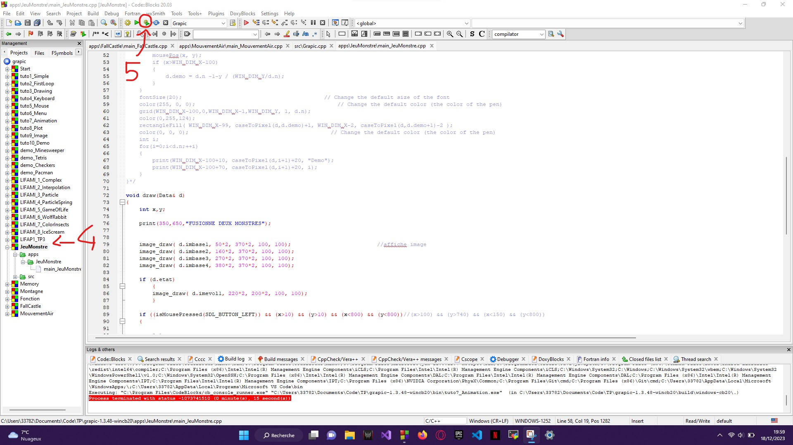

# Game Minesweeper 


## Subject

```
Il s’agit lors des TD/TP de réaliser un jeu de démineur. Dans le TD, les
déclarations de types et les sous-programmes demandés devront être écrits
en langage C/C++.

Principe du jeu :

L'objectif est de trouver les mines qui sont cachées aléatoirement par
l'ordinateur dans les cases du tableau.

Si la case choisie contient une mine, la partie est perdue.

Si la case choisie ne contient pas de mine alors apparaîtra un chiffre
indiquant le nombre de mines qui se trouvent dans les 8 cases qui touchent
directement la case sélectionnée.

Par exemple si le numéro découvert est un 2, cela indique qu'il y a 2 mines cachées parmi les
8 cases qui touchent directement celle choisie.

Attention : seul un affichage en mode texte sera demandé ici.

Construction du jeu :

1. Structures de données :

a. Définir 3 constantes Taille_Grille_X, Taille_Grille_Y et Mines permettant de fixer
les paramètres généraux du jeu. Dans l’exemple précédent, on aura comme valeurs
respectives (9, 9 et 10).

b. Définir une structure case_grille comportant deux informations :
 - un entier représentant le contenu de cette case (-1 si mine, 0..8 pour le nombre
de mines dans les cases adjacentes)
 - un booléen permettant de savoir si cette case a déjà été choisie par l’utilisateur.
Cette valeur indiquera si la case doit être dévoilée à l’utilisateur lors de
l’affichage.

c. Définir la grille de jeu comme étant un tableau 2D de case_grille. Pour des besoins
ultérieurs, nous allons volontairement surdimensionner la grille de jeu en ajoutant
une ligne supplémentaire en haut et en bas et une colonne supplémentaire à droite et
à gauche.

2. Initialisation de la grille de jeu : écrire un sous-programme permettant d’initialiser la
grille de jeu. Pour chacune des cases de la grille du jeu, la valeur numérique sera
initialisée à 0 et le booléen découvert à la valeur "false".

3. Positionnement aléatoire des bombes sur la grille de jeu : écrire un sous-
programme permettant de positionner aléatoirement Mines bombes sur la grille de jeu.
Attention, avant de placer une mine, on vérifiera que la case est "libre".

4. Remplissage complet de la grille de jeu. Dans ce sous-programme, nous allons pour
chacune des cases (hors mine) compter le nombre de mines dans toutes les cases
adjacentes. Pour éviter une gestion trop complexe des cases du pourtour, nous avons,
dans la déclaration, pris soin de rajouter des cellules supplémentaires. Écrire le sous-
programme permettant de remplir la grille avec ces valeurs.

5. Affichage de la grille de jeu. La grille de jeu est stockée en interne sous forme d’un
tableau de structures case_grille contenant une valeur numérique (nombre de mines ou
-1) et un booléen indiquant si la case doit être affichée ou non. Pour rendre la grille
plus lisible pour l’utilisateur, les cases non dévoilées seront affichées avec le symbole
‘-‘, les cases contenant une mine (-1) avec le caractère ‘M’ et les autres cases avec la
valeur numérique correspondant au nombre de mines dans les cases adjacentes. Écrire
un sous-programme permettant d’afficher le contenu de la grille de jeu.

6. Choix d’une case : écrire un sous-programme qui demande à l’utilisateur les
coordonnées de la case à sonder.

7. Jeu : écrire le sous-programme permettant de recommencer le choix d’une case
jusqu’à la fin de la partie.

8. Fin de partie : la partie s’arrête quand toutes les cases ont été découvertes sauf celles
contenant des mines (partie gagnée) ou bien lorsqu’une mine est touchée (partie
perdue). Écrire le programme principal permettant de jouer au démineur.
```
# GrAPiC 

## Starting

Linux, Windows and Mac instruction :

http://licence-info.univ-lyon1.fr/grapic

## Introduction

GrAPiC is a small, easy-to-use framework to add graphical functionalities to your C/C++ code. 
Its main goal is to provide easy graphical functions to be used in introduction courses of algorithm and programming in C/C++. 
It is based on SDL2 but to use it you need to know only few very simples functions. 
The Grapic archive comes with the needed SDL part, you do not have to install SDL. Just unzip and enjoy ! 

## Starting

Compiling from the github (which is not the standard way).

* On Linux you need to install:
- g++
- doxygen
- zip
- lib-sdl2-dev lib-sdl2 sd2_image... sdl2_ttf...

1. sudo apt install g++ premake4 zip doxygen libsdl2-dev libsdl2-mixer-dev libsdl2-image-dev
2. make premake
3. make
(4. script/make_linux_test.sh): to test the archive doc/download/grapic-linux.tgz
(5. script/make_web.sh): to create the zip files in doc/download or to sync everything to the webpage (need passwd).


* On windows
0. Install CB 20
1. run premake-cb20.bat to generate the projects files    or     run premake-lifami.bat to generate lifami projects 
2. open build/windows-cb20/grapic.workspace

## Best way to make a projet in windows

(windows): 
 - Open build/windows-cb20/grapic.workspace in CodeBlocks
 - In the left part (Management) of the logiciel, double clic in the projet of yours choice (it's those in /apps)
 - Finally clic in the green arrow in the top of the screen




## Put your new project in GraPic

Add your directory with your cpp files in "apps" and add the path in "premake4".

